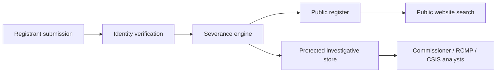

# Canada FITAA Compliance Assessment

> **Template Origin**: Community | **ArcKit Version**: [VERSION] | **Command**: `/arckit.ca-fitaa`

## Document Control

<!-- DOC-CONTROL-HEADER -->
<!-- Resolved at command-execution time per _partials/RENDERING.md. -->
<!-- Classification line MUST be: -->
<!-- | Classification | UNCLASSIFIED / Protected A / Protected B / Protected C / CONFIDENTIAL / SECRET / TOP SECRET | -->

## Revision History

| Version | Date | Author | Changes | Approved By | Approval Date |
|---------|------|--------|---------|-------------|---------------|
| [VERSION] | [YYYY-MM-DD] | ArcKit AI | Initial creation from `/arckit.ca-fitaa` | [PENDING] | [PENDING] |

## Executive Summary

[Two to three paragraphs describing the project's exposure to FITAA, the registration model adopted, the public-vs-protected severance posture, and the headline Charter §2 risk findings. Note any statutory-currency caveats — section numbers or regulations that were `<TBC at draft time>`.]

## Activity Scoping

| Item | Value |
|------|-------|
| Department / agency | [name] |
| Service / programme | [name] |
| Activities under review | [advocacy / convening / communications / engagement / etc.] |
| In-scope arrangements | [arrangements with foreign principals to influence government decisions / political processes / public discourse] |
| Excluded categories | [journalism, academic research, diplomatic activity — subject to standard FITAA exemptions, cite section `<TBC at draft time>`] |
| Decision-tree outcome | [REGISTRABLE / NOT REGISTRABLE / MIXED — explain] |

### Decision Tree (textual)

1. Is there an arrangement with a foreign principal? — [Y/N]
2. Is the arrangement intended to influence a government / political / public-discourse outcome? — [Y/N]
3. Does an exclusion apply (journalism, academic research, diplomatic activity)? — [Y/N, cite `<TBC at draft time>`]
4. Outcome: [REGISTRABLE / NOT REGISTRABLE / MIXED]

## Arrangement Register Design

| Field | Public / Protected | Source | Notes |
|-------|--------------------|--------|-------|
| Registrant identity | Public | Registrant submission | Verified per workflow step 2 |
| Foreign principal | Public | Registrant submission | Identity verified |
| Activity type | Public | Registrant submission | Controlled vocabulary |
| Start / end dates | Public | Registrant submission | Material change → 14-day update |
| Financial flows | Public / Protected | Registrant submission | Public bands; granular figures protected |
| Investigative metadata | Protected | Commissioner / RCMP / CSIS | National-security exemptions per ATIP-Act §15/§16 |
| Severance map | Protected | System-generated | Audited per `ca-atip` rules |

Material-change cadence: registrants must update the register within **14 days** of a material change. The system MUST enforce a 14-day reminder + lockout if the registrant misses the window.

## Registration Workflow

| Step | Channel | Owner | SLA | Notes |
|------|---------|-------|-----|-------|
| 1. Submission | Web (bilingual) / paper fallback | Registrant | n/a | Per `ca-ola` |
| 2. Identity verification | [identity proofing approach] | Commissioner's office | [SLA] | Risk-tiered |
| 3. Acknowledgement + registration ID | Email + portal | System | Same business day | Bilingual |
| 4. Public register publication | Web | System | Within `<TBC>` of acknowledgement | Severance applied |
| 5. Material-change update | Web | Registrant | Within 14 days of change | 14-day clock |

## Public Register vs Protected Investigative Data

| Severance rule | Field | Public outcome | Protected outcome |
|----------------|-------|----------------|-------------------|
| National-security exemption | Investigative metadata | Suppressed | Visible to cleared analysts |
| Personal-information minimisation | Granular financial figures | Bands only | Full figures |
| Withdrawal | Withdrawn registration | Tombstone retained per `<TBC>` | Full record retained for investigative cycle |
| Correction | Erroneous fact | Public correction notice | Audit trail preserved |

Cross-reference `ca-atip` for the formal severance design and `ca-pia` for the personal-information minimisation rationale.

## Commissioner Liaison Protocol

| Trigger | Cadence | Contact | Artefact |
|---------|---------|---------|----------|
| Suspected non-registration | Ad hoc | Commissioner's office (designated liaison) | Referral memo |
| Suspected falsification | Ad hoc | Commissioner's office + RCMP | Evidence package |
| Routine reporting | Quarterly | Commissioner's office | Quarterly compliance report |
| RCMP / CSIS coordination | Per `ca-soia` MOU | Departmental security officer | MOU + tasking record |
| Annual report contribution | Annual | Commissioner's office | Departmental return |

## Charter Risk Register

Cross-reference `ca-charter` for the full Charter §2 expression and association analysis.

| Charter section | Risk | Mitigation | Residual |
|-----------------|------|------------|----------|
| s.2(b) Freedom of expression | Chilling effect on advocacy / journalism | Tight scoping of registrable activity; journalism exclusion clearly applied; tombstone-only public record after withdrawal | [Low / Medium / High] |
| s.2(b) Freedom of expression | Over-broad public exposure of registrant identity | Severance engine; public bands not granular figures; option for protected-only registration in narrow categories `<TBC at draft time>` | [Low / Medium / High] |
| s.2(d) Freedom of association | Disincentive to legitimate diaspora / civil-society engagement | Clear public-interest framing; bilingual plain-language guidance; community-engagement plan | [Low / Medium / High] |
| s.2(d) Freedom of association | Disproportionate burden on small civil-society organisations | Tiered registration burden; small-volume exemption `<TBC>` | [Low / Medium / High] |

## Compliance Schedule (registrant-side)

| Trigger | Clock | Owner | Penalty exposure |
|---------|-------|-------|------------------|
| New registrable arrangement | 14 days from arrangement start | Registrant | FITAA offence §`<TBC at draft time>` — fine up to `<TBC>` |
| Material change | 14 days from change | Registrant | FITAA offence §`<TBC at draft time>` — fine up to `<TBC>` |
| End of arrangement | 14 days from end | Registrant | FITAA offence §`<TBC at draft time>` — fine up to `<TBC>` |
| False / misleading statement | At submission | Registrant | FITAA offence §`<TBC at draft time>` — fine up to `<TBC>` and/or imprisonment |
| Failure to register | Continuing offence | Registrant | FITAA offence §`<TBC at draft time>` — daily-accrual fine `<TBC>` |

## Open Items

Explicit statutory currency caveats — review and update before publication.

- FITAA Regulations: status `<TBC at draft time>` — verify against Canada Gazette II at the verification date below.
- FITAA section numbering for offences and exemptions: marked `<TBC at draft time>` throughout; reconcile against the consolidated Justice Laws text.
- Commissioner's published guidance: identify any operational guidance issued after the verification date and incorporate.
- ATIP-Act severance design: pending `ca-atip` artefact.
- Charter §2 detailed analysis: pending `ca-charter` artefact.
- Privacy Impact Assessment: pending `ca-pia` artefact.
- Algorithmic Impact Assessment: required if registration triage uses any automated decision-making — pending `ca-aia` artefact.
- Bilingual content review: pending `ca-ola` artefact.
- RCMP / CSIS MOU: pending `ca-soia` artefact.

## External References

### Document Register

| Doc ID | Title | URL | Verified date |
|--------|-------|-----|---------------|
| CA-FITAA-2024 | Foreign Influence Transparency and Accountability Act (Bill C-70, 2024) | <https://laws-lois.justice.gc.ca/> | [YYYY-MM-DD] |
| CA-FITAA-REG | FITAA Regulations (status: `<TBC at draft time>`) | <https://gazette.gc.ca/> | [YYYY-MM-DD] |
| CA-OCFIT | Office of the Commissioner of Foreign Influence Transparency — published guidance | [URL when published] | [YYYY-MM-DD] |
| CA-CHARTER | Canadian Charter of Rights and Freedoms | <https://laws-lois.justice.gc.ca/eng/const/page-12.html> | [YYYY-MM-DD] |
| CA-ATIP-ACT | Access to Information Act | <https://laws-lois.justice.gc.ca/eng/acts/A-1/> | [YYYY-MM-DD] |

### Citations

| Citation | Doc ID | Section | Used in |
|----------|--------|---------|---------|
| [FITAA-1] | CA-FITAA-2024 | Activity scoping triggers `<TBC at draft time>` | Activity Scoping |
| [FITAA-2] | CA-FITAA-2024 | Registration obligations `<TBC at draft time>` | Arrangement Register Design |
| [FITAA-3] | CA-FITAA-2024 | Offences and penalties `<TBC at draft time>` | Compliance Schedule |
| [CHARTER-1] | CA-CHARTER | s.2(b) | Charter Risk Register |
| [CHARTER-2] | CA-CHARTER | s.2(d) | Charter Risk Register |
| [ATIP-1] | CA-ATIP-ACT | §15 (national security) | Public vs Protected severance |
| [ATIP-2] | CA-ATIP-ACT | §16 (law enforcement) | Public vs Protected severance |

### Unreferenced Documents

[List any documents read during generation but not cited, or "None".]
