# ArcKit Workflow Diagrams

This document contains Mermaid diagrams for all 5 ArcKit workflow paths based on the Dependency Structure Matrix.

**Legend**:

- **Blue boxes** = Foundation commands (Tier 0-1)
- **Green boxes** = Core workflow (Tier 2-7)
- **Orange boxes** = Design & Implementation (Tier 8-9)
- **Purple boxes** = Quality & Operations (Tier 11-12)
- **Red boxes** = Compliance (Tier 13)
- **Gold boxes** = Project Story & Reporting (Tier 14)
- **Solid arrows (→)** = Mandatory sequential flow
- **Dotted arrows (-.->)** = Recommended dependencies or optional inputs

---

## 1. Standard Project Path (Non-AI, Non-Government)

For private sector and non-UK government projects without AI components.

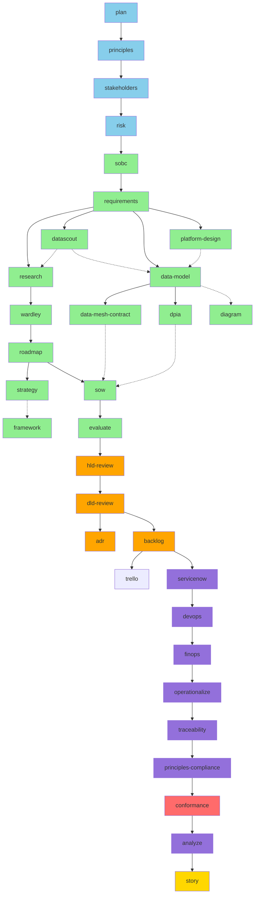

**Duration**: 4-8 months
**Key Milestones**: SOBC Approval → Strategy/Requirements Sign-off → DPIA Complete → ADR Approved → Sprint 1 → Go Live

---

## 2. UK Government Project Path

For UK Government civilian departments (non-AI projects).

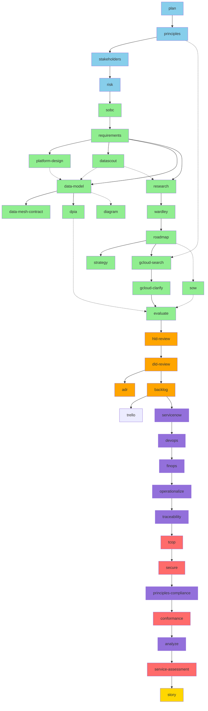

**Duration**: 6-12 months
**Key Milestones**: SOBC Approval → Strategy/Requirements Sign-off → DPIA Complete → G-Cloud Clarifications → Service Assessment → Go Live

---

## 3. UK Government AI Project Path

For UK Government projects with AI/ML components.

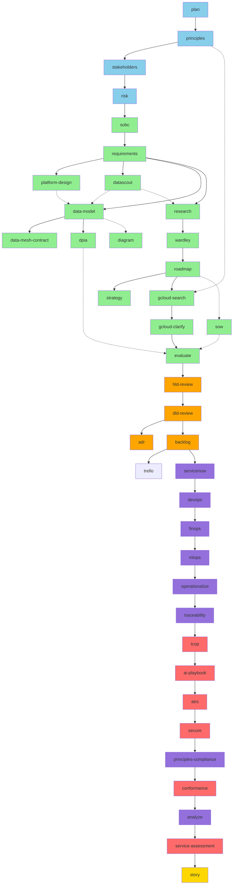

**Duration**: 9-18 months
**Key Milestones**: SOBC Approval → Strategy/Requirements Sign-off → DPIA Complete → G-Cloud Clarifications → AI Playbook Approval → ATRS Publication → Service Assessment → Go Live

**Critical Gates**:

- AI Playbook compliance required before Beta
- ATRS publication required before Live

---

## 4. MOD Defence Project Path

For Ministry of Defence projects (non-AI).

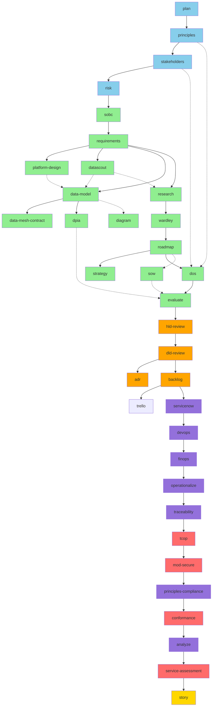

**Duration**: 12-24 months
**Key Milestones**: SOBC Approval → Strategy/Requirements Sign-off → DPIA Complete → DOS Down-select → MOD Secure by Design Approval → Service Assessment → Go Live

**Critical Gates**:

- MOD Secure by Design (JSP 440, IAMM) required before Beta
- Security clearances required for team

---

## 5. MOD Defence AI Project Path

For Ministry of Defence projects with AI/ML components.

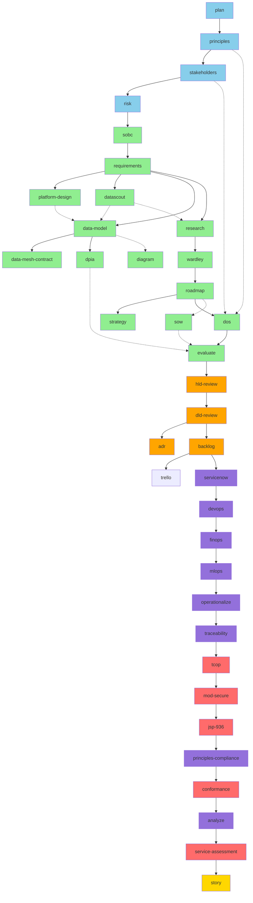

**Duration**: 18-36 months
**Key Milestones**: SOBC Approval → Strategy/Requirements Sign-off → DPIA Complete → DOS Down-select → MOD Secure by Design + JSP 936 Approval → Service Assessment → Go Live

**Critical Gates**:

- MOD Secure by Design required before Beta
- JSP 936 AI assurance required before Beta
- Risk classification determines approval pathway:
  - **Critical**: 2PUS/Ministerial approval
  - **Severe/Major**: Defence-Level JROC/IAC approval
  - **Moderate/Minor**: TLB-Level approval

---

## 6. Wardley Mapping Suite

The Wardley Mapping suite provides a focused strategic analysis pipeline. Value chain decomposition feeds into map creation, which then branches into three parallel analysis tracks.

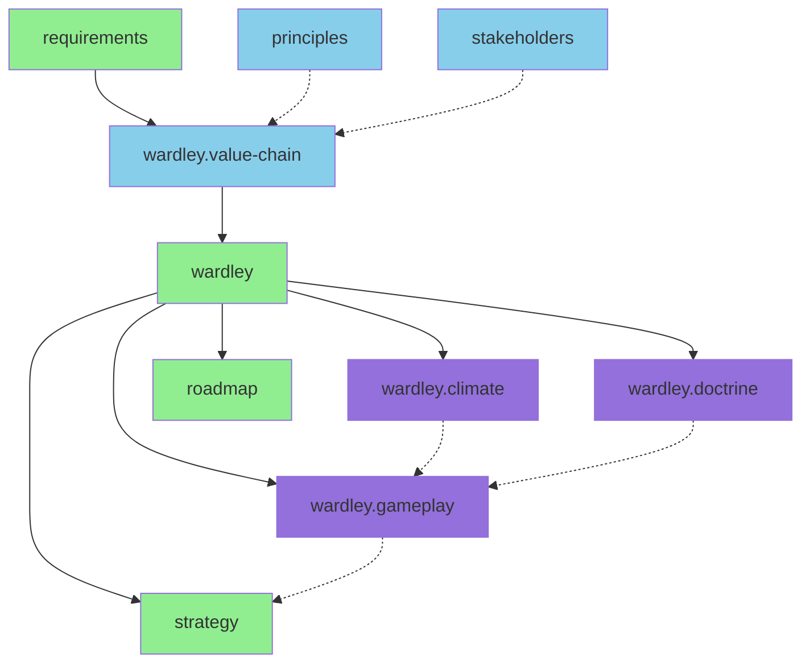

**Key:**

- **Blue boxes** = Foundation inputs and value chain decomposition
- **Green boxes** = Core workflow (requirements, wardley map, downstream)
- **Purple boxes** = Wardley analysis tracks (doctrine, climate, gameplay)

**Duration**: 1-3 weeks (within the Alpha phase)

---

## 7. Canada Federal Workflow

> ⚠️ **[COMMUNITY]** Canada Federal Overlay — community-contributed by @tractorjuice, recruiting Canadian federal domain co-maintainer. Output should be reviewed by qualified DOJ counsel, departmental Privacy Officer / ATIP coordinator, and security officer before reliance.

The Canada Federal Overlay ships 12 `ca-*` commands covering FITAA (Bill C-70 2024), Privacy Act PIA, ATIP reconciliation, Algorithmic Impact Assessment, Charter rights, ITSG-33, SOIA classified handling, sovereign cloud residency, GC Digital Standards, Official Languages Act, PSPC procurement, and OCAP® Indigenous data sovereignty. Two canonical execution chains apply depending on whether the system engages FITAA.

### 7a. FITAA-class application (full overlay)

For systems that fall in scope of the Foreign Influence Transparency and Accountability Act — registration tooling, foreign-principal exposure, public-office-holder interactions — the canonical chain runs all 12 `ca-*` commands.

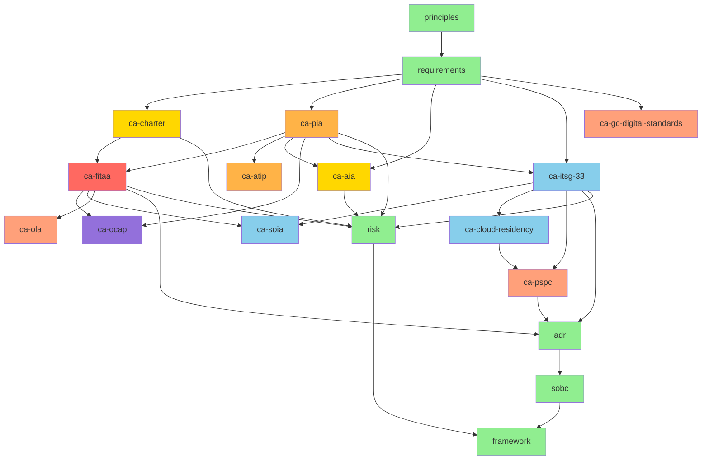

**Key:**

- **Green boxes** = Foundation inputs and standard cross-cutting outputs
- **Red box** = FITAA flagship (Bill C-70 2024 foreign-influence registration)
- **Orange boxes** = Privacy stream (Privacy Act PIA, ATIP reconciliation)
- **Gold boxes** = Charter rights and Algorithmic Impact Assessment
- **Purple box** = OCAP® First Nations data sovereignty (only when Indigenous data in scope)
- **Blue boxes** = Security stream (ITSG-33, SOIA, sovereign cloud residency)
- **Salmon boxes** = Service-side compliance and procurement (OLA, GC Digital Standards, PSPC)

### 7b. Generic federal Canadian application (no FITAA exposure)

For federal Canadian digital services that do not engage FITAA, drop `ca-charter` (run only if rights-engaging), `ca-fitaa`, and `ca-soia` (run only if classified leads in scope).

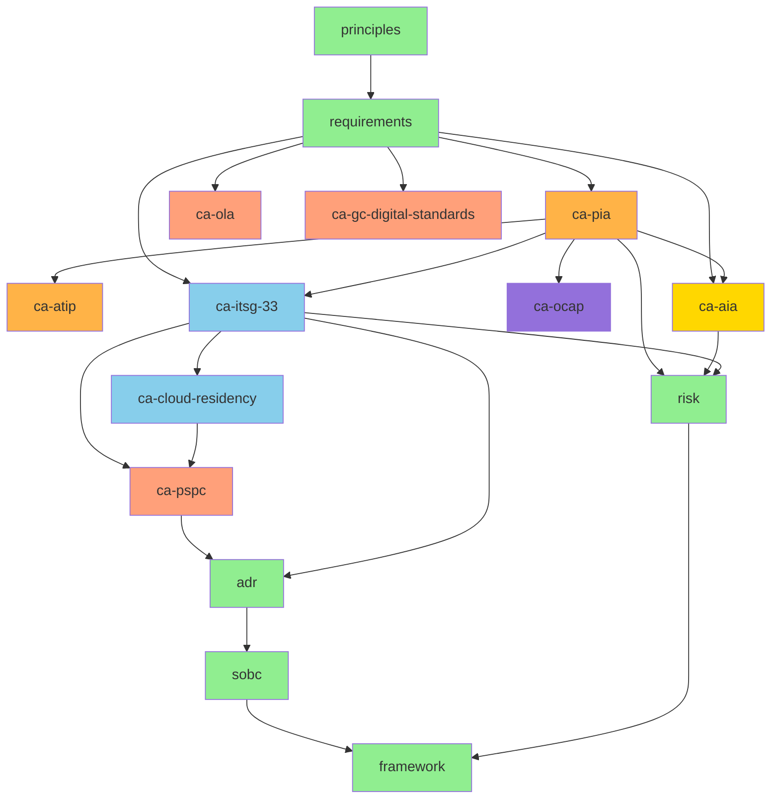

**Prerequisites**: Set `governance_framework: Canada Federal` and `classification_scheme: GC Security Categorization` in plugin userConfig before running. Each command's full guide is in [`docs/guides/`](guides/) (`ca-fitaa.md`, `ca-pia.md`, etc.).

**Duration**: 6-10 weeks for a full FITAA-class build (procurement and OLA streams run in parallel with security and privacy). 3-5 weeks for the generic federal path.

---

## 8. UAE Federal Workflow

For UAE federal entities, contracted suppliers, and CII operators, the canonical chain runs the 12 `uae-*` commands in sequence between the standard inputs (requirements, data-model, risk) and the cross-cutting outputs (sobc, wardley, framework).

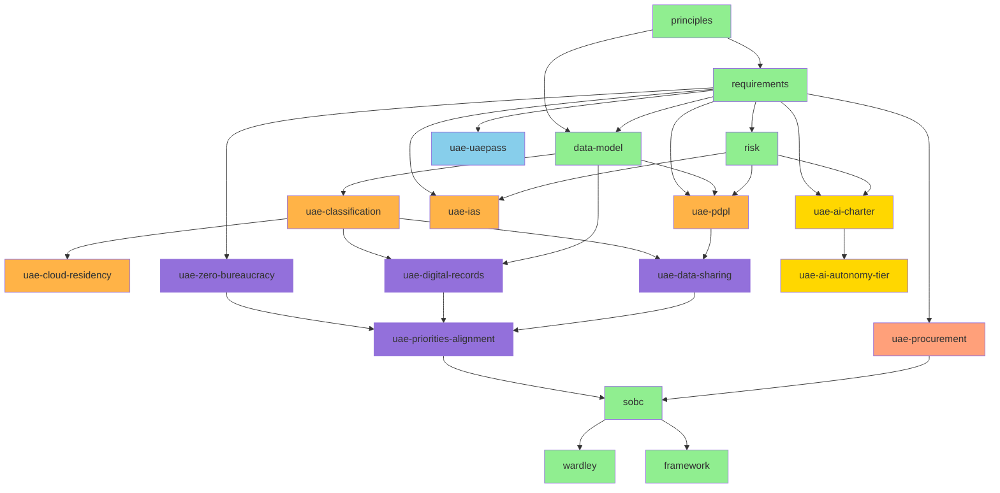

**Key:**

- **Green boxes** = Foundation inputs and standard cross-cutting outputs
- **Orange boxes (light)** = UAE federal data and security (classification, PDPL, IAS, cloud residency)
- **Blue boxes** = UAE federal identity (UAE Pass)
- **Purple boxes** = UAE Cabinet instruments (Zero Bureaucracy, Digital Records, Data Sharing, National Priorities Alignment)
- **Gold boxes** = UAE AI governance (Charter, Autonomy Tier)
- **Salmon box** = UAE federal procurement (Decree-Law No. 11 of 2023)

**Prerequisites**: Set `governance_framework: UAE Federal` and `classification_scheme: UAE Smart Data` in plugin userConfig before running. The reference implementation is the `arckit-test-project-v20-uae-moi-ipad` test repo. Full overlay guide at [`docs/guides/uae-overlay.md`](guides/uae-overlay.md).

**Duration**: 4-8 weeks for a full federal pathfinder (the AI tier and procurement work runs in parallel with the data and security stream).

---

## 9. Government Code Discovery

For UK Government projects, run these commands during Alpha/Beta to check for reusable code before building from scratch. Uses the govreposcrape MCP server (no API key required).

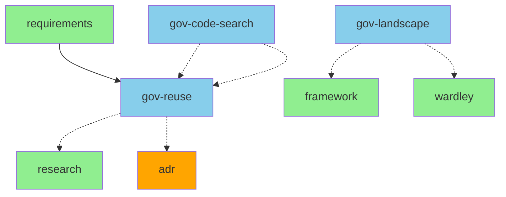

**Key:**

- **Blue boxes** = Government code discovery commands (use govreposcrape MCP)
- **Green boxes** = Standard workflow commands that consume discovery outputs
- **Orange boxes** = Decision records informed by reuse assessment

**When to use:**

- Run `gov-code-search` first to find relevant existing code
- Run `gov-reuse` after requirements to assess specific reuse opportunities before build-vs-buy
- Run `gov-landscape` to understand the broader government code ecosystem for a domain

**Duration**: 0.5-2 days (before or during research phase)

---

## Command Dependency Legend

### Dependency Types in Diagrams

- **Solid arrows (→)**: Mandatory/Recommended sequential flow
- **Dotted arrows (-.->)**: Optional parallel activities

### Tier Groupings

| Tier | Phase | Commands |
|------|-------|----------|
| 0 | Foundation | plan, principles |
| 1 | Strategic Context | stakeholders |
| 2 | Risk Assessment | risk |
| 3 | Business Justification | sobc |
| 4 | Requirements | requirements |
| 5 | Strategic Planning & Synthesis | platform-design, roadmap, strategy, framework, glossary |
| 6 | Detailed Design | data-model, data-mesh-contract, dpia, research, azure-research*, aws-research*, gcp-research*, datascout, gov-reuse†, gov-code-search†, gov-landscape†, dfd, wardley, wardley.value-chain, wardley.doctrine, wardley.gameplay, wardley.climate, diagram, adr |
| 7 | Procurement | sow, dos, gcloud-search, gcloud-clarify, evaluate, score |
| 8 | Design Reviews | hld-review, dld-review |
| 9 | Implementation | backlog |
| 10 | Backlog Export | trello |
| 11-12 | Operations & Quality | servicenow, devops, finops, mlops (AI projects), operationalize, traceability, analyze, principles-compliance |
| 13 | Compliance | conformance, maturity-model, service-assessment, tcop, ai-playbook, atrs, secure, mod-secure, jsp-936 |
| 14 | Reporting | story, presentation |
| 15 | Publishing | pages |

> **\*** `azure-research` and `aws-research` are alternatives to `research` for cloud-specific projects. Each requires its respective MCP server.
> **datascout** discovers external data sources (APIs, datasets, open data portals) and feeds into data-model and research.
> **†** `gov-reuse`, `gov-code-search`, and `gov-landscape` use the govreposcrape MCP server (no API key required) to search 24,500+ UK government repositories.

---

## Alternative View: Gantt Chart Format

For project planning purposes, here's a Gantt chart representation of a typical UK Government AI project:

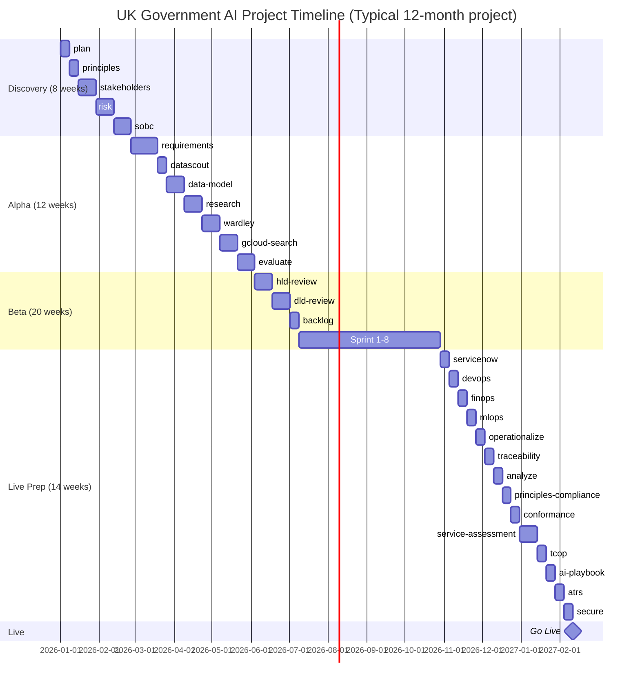

---

## Workflow Decision Tree

Use this decision tree to determine which workflow path to follow:

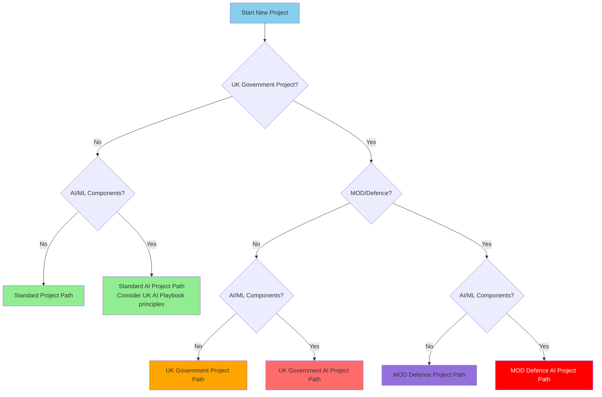

---

## Common Variations

### Fast-Track Path (Existing Architecture)

If architecture principles and governance already established:

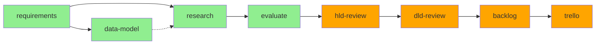

**Duration**: 2-4 months
**Use When**: Enhancement to existing system, clear architecture patterns

### Compliance-Only Path

For auditing existing projects:

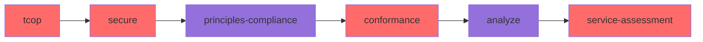

**Duration**: 2-4 weeks
**Use When**: Pre-assessment preparation, audit requirements

---

## Version

- **ArcKit Version**: 1.3.0
- **Document Date**: 2026-03-16
- **Based On**: DEPENDENCY-MATRIX.md (with Phase 2 R-level dependencies)
- **Commands Documented**: 48
- **Key Changes**:
  - Added Wardley Mapping Suite workflow diagram (wardley.value-chain, wardley.doctrine, wardley.climate, wardley.gameplay)
  - Updated Tier 6 Detailed Design to include 4 new Wardley suite commands
  - Previous: Added conformance node to all 5 workflow paths (between principles-compliance and analyze)
  - Added conformance to Compliance-Only Path and Gantt chart
  - Updated Tier 13 Compliance to include conformance
  - Previous: Added missing style definitions for finops nodes in all workflow diagrams
  - Previous: Updated Tier Groupings table to include all 68 commands across 16 tiers
  - Previous: Added principles-compliance to Operations & Quality tier
